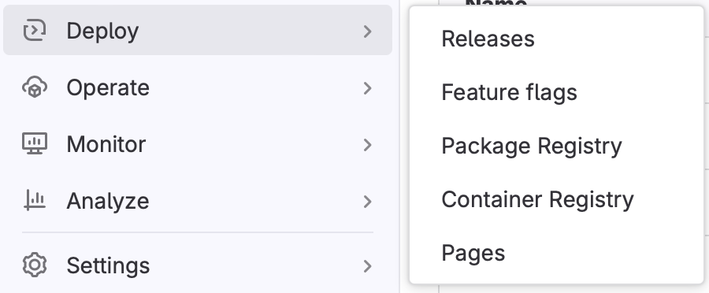
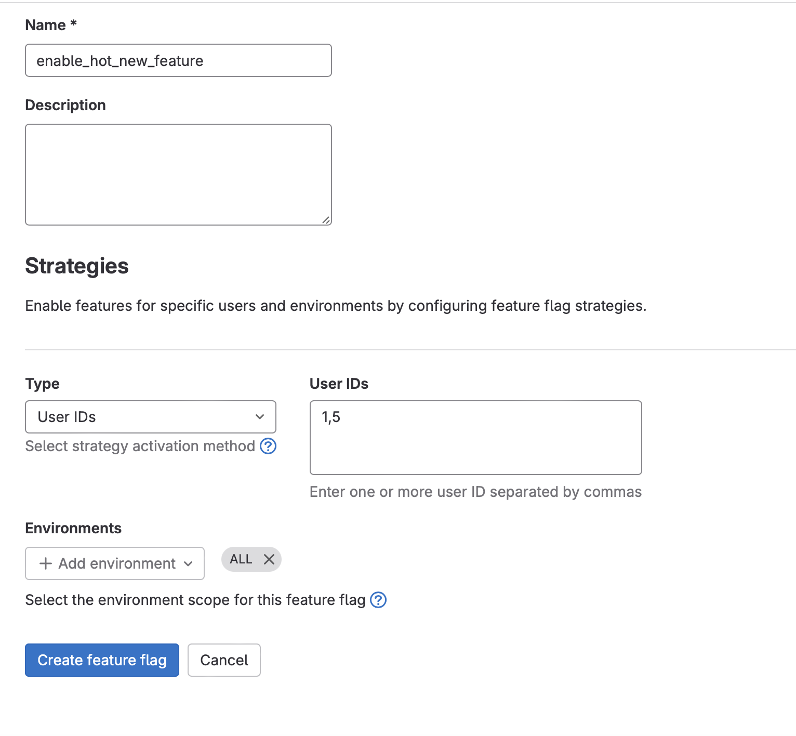

Transitioning to [GitLab](https://gitlab.com) for source control for [Ledgerpost](https://ledgerpost.xyz), offered a fresh experience compared to my familiarity with [GitHub](https://github.com). A standout perk of GitLab is its generous provision of Feature Flags—at [no cost for the first 50 flags](https://docs.gitlab.com/ee/operations/feature_flags.html#maximum-number-of-feature-flags). This functionality positions GitLab alongside specialized services like LaunchDarkly and CloudBees, making it an attractive choice for developers looking to manage feature rollouts effectively.

TL;DR - [Just give me the solution](#implementation)

### Why Use Feature Flags

**Minimal Effort**

Sometimes you are unsure if the feature you want to implement will resonate with your users. Before you embark on the path on a multi-month roadmap you can put in minimal amount of effort into a new feature and roll it out to a select group of users, allowing you to gather valuable feedback and assess the feature's impact before a wide-scale roll-out.

**Smaller Pull Requests**

When trying to do high quality code reviews, it's difficult to wade through a 50+ file PR that could take weeks to ship. The longer the PR takes to deliver, the focus declines and bugs can slip through. Additionally, if there are other engineers working on the same codebase, this increases the likelihood of merge conflicts which causes pain and generally increases friction. If we want to increase the efficiency and productivity of your team, we need to ensure these PRs remain small and each story/feature can be delivered in no more than 3 days. Always be shipping. If you break down that large, 11-point story into a multi-story Epic, we can employ Feature Flags as a control mechanism to hide the work-in-progress features from the users.

**Reduce Risk**

Introducing new features carries inherent risks. Users may interact with your product in unexpected ways, leading to unanticipated bugs that can erode trust in your application, potentially causing user attrition. A more cautious strategy for feature release involves a targeted approach: unveiling new functionalities to a specific subset of your user base or incrementally to a percentage of your audience. This method allows you to gauge user response and system stability, providing a safeguard against widespread issues.

**Extract Conditional Complexity from your Business Logic**

Embedding conditionals directly into source code for user-specific feature access is not ideal. It entangles your business logic with user access controls, and updating the access list means submitting a new pull request (PR) and deployment each time. By delegating this logic to a feature flag service provider, I gain the flexibility to alter feature flag configurations on the fly. This approach eliminates the need for immediate code changes and PRs, streamlining the process and keeping the business logic clean.

### Why Use Gitlab As Your Configuration Provider

One of the primary considerations in selecting a feature flag configuration provider is cost. GitLab stands out by offering this service free of charge, which is particularly appealing for teams looking to minimize expenses. While LaunchDarkly leads the market with its feature-rich platform, starting at $8.33 per month per user, and CloudBees offers a free community version, my hands-on experience with GitLab has been overwhelmingly positive, solidifying my preference for it over CloudBees.

### Implementation

**Setup Gitlab**

In the corresponding repository of the application, go to "Deploy > Feature Flags"


- Click on "Configure"
- A modal will appear and copy the `API URL` and `Instance ID`, we will inject these into our app via environment variables.
- Dismiss the modal

**Let's create our first Feature Flag**

Back at the main Feature Flag menu, click on the "New Feature Flag" button


For our feature flag name, I like to use the format of `<action>_name_of_feature`. In this instance, let's call it "enable_hot_new_feature"

For Type, click on `User IDs`, enter `1,5`

For Environments, this will be the environment in which we intend to have this Feature Flag active. In this instance, let's just call it "ALL"

**Add To Your Rails Code**

The way that GitLab is providing their Feature Flag management tool is by way of the Open Source project, Unleash.

If you're using ruby, you'll need to add the `unleash` gem

```bash
bundler add unleash
```

Then we'll need to create an Unleash initializer file:

```bash
# config/initializers/unleash.rb

Unleash.configure do |config|
  config.app_name    = ENV['UNLEASH_APP_NAME']
  config.url         = ENV['UNLEASH_URL']
  config.instance_id = ENV['UNLEASH_INSTANCE_ID']
  config.logger      = Rails.logger
end

Rails.configuration.unleash = Unleash::Client.new
```

Note: `UNLEASH_APP_NAME` does not refer to the name of your application but the name of the environment you intend to have the Feature Flag reflected in, e.g. production, or in this instance "ALL" as we stated above

Before we test it out in rails console, we'll need to update the file that you use to manage your environment variables whether it's in your `.env` file or your `config/application.yml` file via figaro and set them accordingly.

After that is setup, you can run `rails console`

```bash
context = Unleash::Context.new
context.user_id = "1" # Note the type needs to be String

Rails.configuration.unleash.is_enabled?("enable_hot_new_feature", context)
=> true

context.user_id = "2"

Rails.configuration.unleash.is_enabled?("enable_hot_new_feature", context)
=> false
```

In this instance, I'm testing to see if only the User with id=1 can view/use "hot_new_feature".

If we don't want to tie the feature to a user, maybe it's a binary OFF/ON feature, we could do:

```bash
Rails.configuration.unleash.is_enabled?("enable_hot_new_feature")
```

You can read more about the various Feature flag strategies on the [GitLab documentation page](https://docs.gitlab.com/ee/operations/feature_flags.html#feature-flag-strategies)
